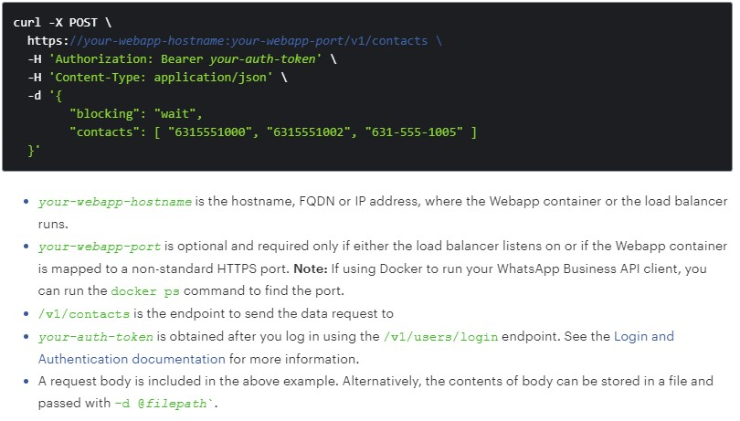
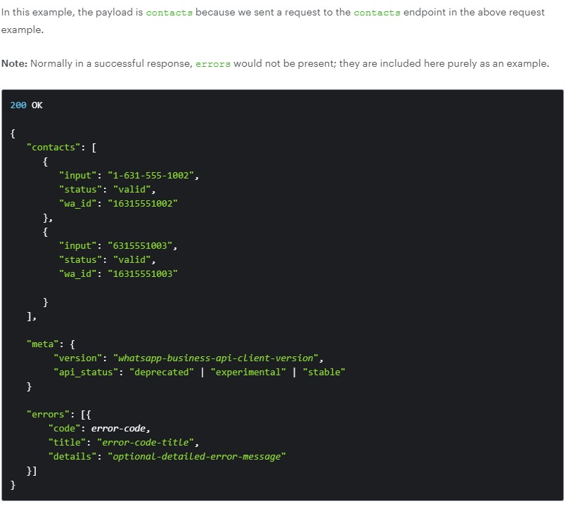
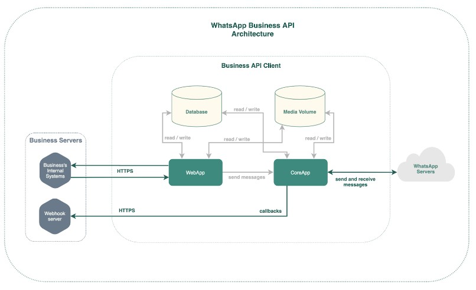

# Research on WhatsApp

## Authentication

> To use the WhatsApp Business API, you must authenticate yourself. Only users with valid authentication tokens can access the service.

## Tokens

> A bearer token will be returned after a successful login, and it is sent in the authorization header of HTTP request.

### Expiration

A token can expire:

1. Periodic:  expired in 7 days
2. Explicit:  expired after logout. 

### Headers

create your own header by:

1. Create the `username:password` string
2. do base64-encode to the string
3. add it as `Authorization` attribute in a header

> e.g., `admin:secret`  => `Authorization: Basic YWRtaW46c2VjcmV0`

## API Keys

> WhatsApp also provides API keys as an alternative to tokens. Because a token expires in 7 days which may cause inconvenience.
>
> The API key you set must have a minimum of 12 characters and a maximum of 128 characters. The Webapp must be restarted whenever you change the API key.

## API Requests

> WhatsApp supports 5 common methods:
>
> - POST
> - GET
> - DELETE
> - PATCH
> - PUT
>
> In RESTful API form!

## API Responses

> A WhatsApp Business API response has the following components:
>
> 1. **HTTP Status Code**
>    - Status codes are issued by the server in response to a request made to the server. See [HTTP Status Codes](https://developers.facebook.com/docs/whatsapp/api/errors#http) for more information.
> 2. **Payload**
>    - *Only returned with a successful response.* The payload object name and contents vary based on the request
> 3. **Meta**
>    - Contains generic information such as the WhatsApp Business API client version
> 4. **Errors**
>    - *Only returned with a failed request.* Contains an array of error objects that are present when there is an error. See the [Error Codes](https://developers.facebook.com/docs/whatsapp/api/Errors/Errors#error) for more information.

## Capacity Rate Limits

> WhatsApp limits the requests each endpoint can send is 50 requests/second and allow bursts to be 150 requests/second
>
> Prevent DDOS Attack.

## Client Architecture

### Components

- WebApp node
  - Handles [authentication and authorization](https://developers.facebook.com/docs/whatsapp/api/users/login) of WhatsApp Business API users
  - Accepts incoming [Rest API calls](https://developers.facebook.com/docs/whatsapp/api/reference) from your business systems and forwards them to the CoreApp node(s)
- CoreApp node(s)
  - Receives [Rest API ](https://developers.facebook.com/docs/whatsapp/api/reference)calls from the WebApp node, and sends resulting messages to the WhatsApp server
  - After receiving messages from the WhatsApp server, sends messages to your Webhook server that include the incoming payload from the WhatsApp servers
  - Downloads and saves media to the media volume
- Database
  - Stores data for the WhatsApp Business API client, including messages, contacts, configurations etc.
- Media volume
  - Stores [uploaded media files](https://developers.facebook.com/docs/whatsapp/api/media) used for outgoing media messages / media message templates, as well as the media files from incoming media messages
- WebHook server
  - Receives incoming HTTP messages from the CoreApp nodes

## APIS

1. **Account [POST]**
   - The `account` node is for registering your WhatsApp Business API client.
   - **Verify [POST]**
     - Once you have received the [registration code via your specified method](https://developers.facebook.com/docs/whatsapp/api/account), you can complete your account registration by sending an API call to `/v1/account/verify`.
   - **Shards [POST]**
     - You can use `/v1/account/shards` to achieve [multi-connect](https://developers.facebook.com/docs/whatsapp/multiconnect_mc) with the [WhatsApp Business API client](https://developers.facebook.com/docs/whatsapp/on-premises/get-started#client-setup).
2. Certificates
3. **Contacts [POST]**
   - Use the `contacts` node to manage WhatsApp users in your database by validating them before sending messages and verify a user's identity with identity hashes.
   - **Identity [GET]**
     - A `GET` call to this endpoint retrieves the latest identity hash for a user.
4. **Health [GET]**
   - Use the `health` node to check the status of your WhatsApp Business API client.
5. **Media [POST]**
   - Use the `media` node to upload, retrieve, or delete media.
   - **Media ID [GET] [DELETE]**
     - Given a specific ID, use this endpoint to retrieve or delete your media.
6. **Messages [POST]**
   - Use the `messages` node to send text, media, contacts, locations, and interactive messages, as well as message templates to your customers.
7. Metrics [GET]
   - Use the `metrics` node to collect important data about your website such as number of processes and outgoing traffic.
8. Services [PUT]
   - The `/services/message/gc` endpoint provides a way for businesses to delete messages from the database associated with their WhatsApp Business API client.
9. Settings
10. Message Templates ? 
    - A message template is required to start a [business-initiated conversation](https://developers.facebook.com/docs/whatsapp/conversation-types). These conversations can be customer care messages or appointment reminders, payment or shipping updates, alerts, and more.
11. **Stats**
    - Collect important stats about your Coreapp and database with the `stats` node. Measure the performance of your queue with current queue callback size and number of pending messages.
    - App [GET]
      - Use the `/v1/stats/app` endpoint to retrieve Coreapp stats.
    - DB [GET]
      - Use the `/v1/stats/db` endpoint to retrieve database stats.
12. **Stickerpacks [GET]**
    - Use the `stickerpacks` node to manage both first-party and third-party stickerpacks and stickers.
    - **Stickerpack ID [GET] [PATCH] [DELETE]**
      - Use this endpoint to retrieve, update, delete a specific stickerpack.
    - Sticker [GET] [POST] [PATCH] [DELETE]
      - Sticker operations
13. Support [GET]
    - Use the `support` node to get help with your WhatsApp Business API client. See [Contact Support](https://developers.facebook.com/docs/whatsapp/contact-support) for more information on opening a Direct Support ticket.
14. **Users [POST]**
    - Use the `users` node for managing authentication and accessing the WhatsApp Business On-Premises API Client.
    - **Login [POST]**
      - To authenticate yourself with WhatsApp Business API client, you must log in. To log in, send your username and password over basic authentication and receive a bearer token in response. Then, you then use the bearer token for authentication when sending requests to any WhatsApp Business API endpoint. Learn more about [authentication](https://developers.facebook.com/docs/whatsapp/using-the-api#authentication) to use the API.
    - **Logout [POST]**
      - Use the `/v1/users/logout` endpoint to logout of the WhatsApp Business API Client. Logging out revokes the authentication token.
    - **User [GET] [PUT] [DELETE]**
      - Use this endpoint to retrieve, delete, or update a user account.
15. Components (WebHook) ?
16. **Received Messages**
    - When you receive an inboud message, a notification is sent to the Webhook URL you set in the [application settings](https://developers.facebook.com/docs/whatsapp/api/settings/app).
17. **Status and Pricing Notifications**
    - The WhatsApp Business API client sends notifications about the [`status` of the message](https://developers.facebook.com/docs/whatsapp/on-premises/webhooks/outbound#notification-types) between you and your users. These notifications are sent via the [`statuses` object](https://developers.facebook.com/docs/whatsapp/api/webhooks/components#statuses-object).

- reference 改下日期
- 课号和专业名词，加到section11里
- shang改语法
- plan里加一下github链接